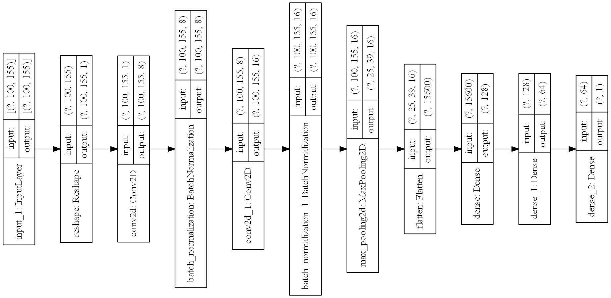

# DDoS DeepLearning Approach

使用深度学习模型完成的DDoS流识别。

## 在ISCXIDS 2012数据集上的模型

在ISCXIDS 2012数据集上的实现的基本策略参考了[LUCID: A Practical, Lightweight Deep Learning Solution for DDoS Attack Detection](https://arxiv.org/abs/2002.04902)，并参照了其中的数据集处理的策略对ISCXIDS 2012数据集进行了预处理。

### 数据集

下载地址：[Intrusion detection evaluation dataset (ISCXIDS2012)](https://www.unb.ca/cic/datasets/ids.html)

```shell
.data_loaders
└─ISCXIDS_2012
  ├─make_dataset.py
  ├─xml_reader.py
  └─unpack_pcap.py
```

最终的加载结果是将数据包按四元组（源IP-源端口-目的IP-目的端口）为ID区分开来的流在各个时间段（INTERVAL）内采样出一定的数量，形成一个二维的结果，从而使用卷积网络进行处理。
最后的形状应该为：`[采样的流量个数,特征数]`。  
其中不足的使用0填充。对于特征，需要经过规范化成为`[0,1]`上的数值。

**unpack_pcap.py**

ISCXIDS 2012数据集使用pcap格式保存了DDoS出现当日所有的数据流量，因此定义了解析pcap格式的类。使用scapy解析如此大的抓包文件会非常慢，因此转而使用dpkt来解析。  
解析和特征提取耗时10分钟左右，解析的特征存储在以四元组为关键字的字典中。  
为了加快加载，`cache`和`load_from_chache`方法使用JSON来保存提取的结果，将加载速度提升至20秒左右。  
使用`save_to_csv`可以生成之后制作数据集所使用的CSV格式数据，从而支持按需读取到内存中，免去约2GB的数据集内存占用和加载耗时。  

**xml_reader.py**

读取XML格式的Label。也使用四元组作为键存储在字典中。

**make_dataset.py**

调用Tensorflow API制作成为tf.data.Dataset类。

### 流量特征提取


### 模型

训练模型采用论文中所提到的卷积+全连接结构，即为十分普通的CNN模型，十分简单，训练也十分快速，不过为了能快速处理大量流量小一些也是应该的。  



```shell
Model: "model"
_________________________________________________________________
Layer (type)                 Output Shape              Param #   
=================================================================
input_1 (InputLayer)         [(None, 100, 155)]        0         
_________________________________________________________________
reshape (Reshape)            (None, 100, 155, 1)       0         
_________________________________________________________________
conv2d (Conv2D)              (None, 100, 155, 8)       80        
_________________________________________________________________
batch_normalization (BatchNo (None, 100, 155, 8)       32        
_________________________________________________________________
conv2d_1 (Conv2D)            (None, 100, 155, 16)      528       
_________________________________________________________________
batch_normalization_1 (Batch (None, 100, 155, 16)      64        
_________________________________________________________________
max_pooling2d (MaxPooling2D) (None, 25, 39, 16)        0         
_________________________________________________________________
flatten (Flatten)            (None, 15600)             0         
_________________________________________________________________
dense (Dense)                (None, 128)               1996928   
_________________________________________________________________
dense_1 (Dense)              (None, 64)                8256      
_________________________________________________________________
dense_2 (Dense)              (None, 1)                 65        
=================================================================
Total params: 2,005,953
Trainable params: 2,005,905
Non-trainable params: 48
_________________________________________________________________
```

### 使用

待补充...
会发布一个带训练好的模型的Release，并详细测试下各个情况下的正确率。

